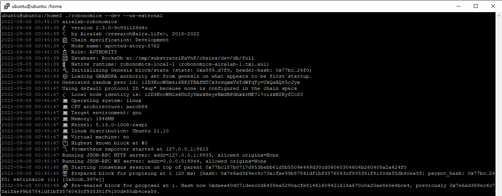
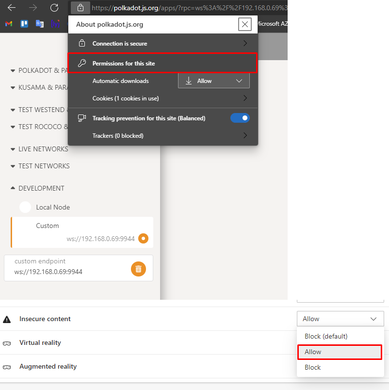
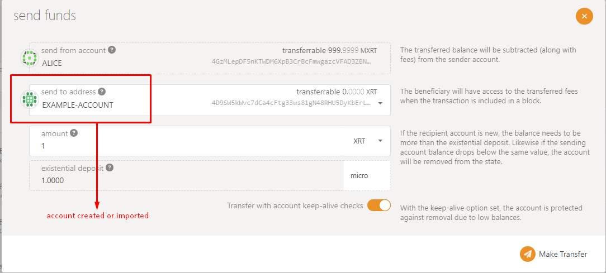

# How to run robonomics dev node
1. First, you need a binary file, download the archive with it from the [latest release](https://github.com/airalab/robonomics/releases).

2. Unpack it and change permissions:
```
tar xf robonomics-x.x.x-{x86_64|aarch64}-unknown-linux-gnu.tar.gz
chmod +x robonomics
```

3. And run in the dev mode:
```
./robonomics --dev --ws-external
```
You will see the following output:



## Account management
Ingresamos a la red development, desde un navegador y que sea en la Local Area Network


Enable insecure content



We are already connected to the local node


# Get tokens
Podemos utilizar la misma cuenta que creamos en el paso --
Necesitaremos XRT para los fees


